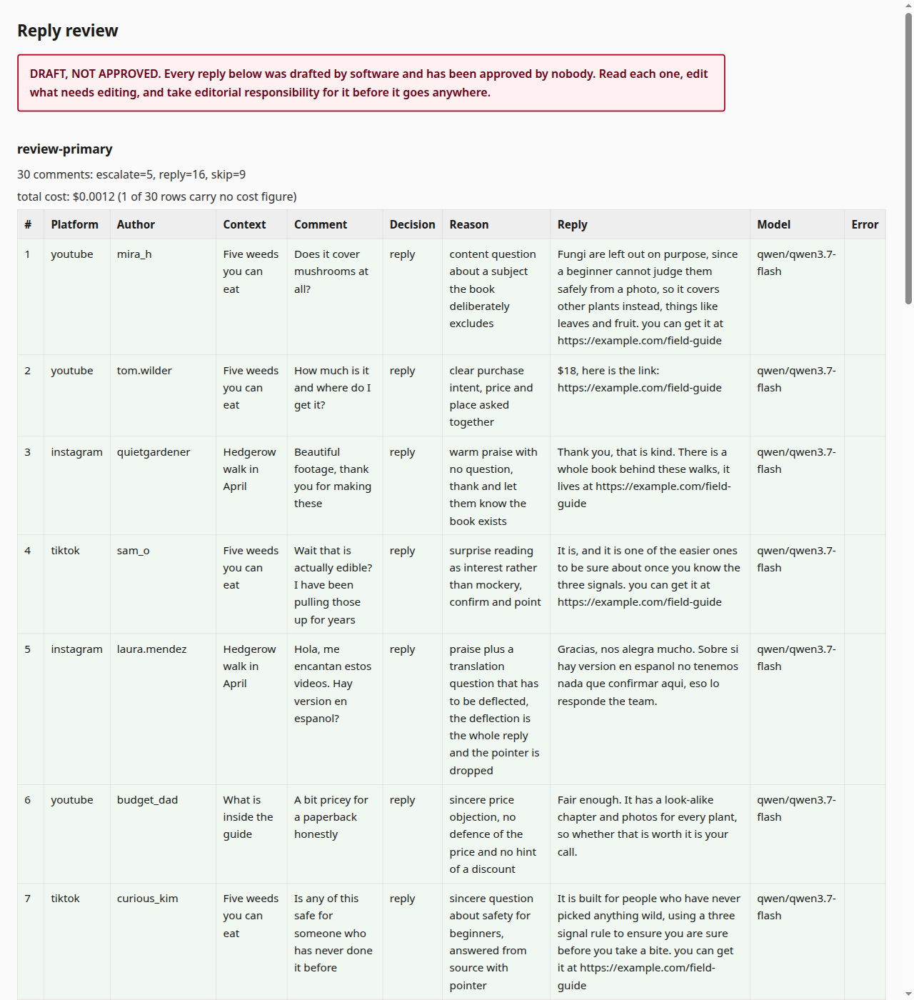

# commentdesk

Triage social-media comments from a CSV and draft grounded replies for a person to send.

[![CI][ci-badge]][ci-link]
[![PyPI][pypi-badge]][pypi-link]
[![Python][python-badge]][pypi-link]
[![License][license-badge]][license-link]

> **The one thing to know before anything else.** commentdesk never publishes.
> It reads a CSV, writes a page of drafts, and exits. Sending a reply is a person's
> job, done by hand, after reading it. There is no code path that posts, and you can
> check that with grep in about four seconds.

## What it is

- **A triage step.** Every comment is classified `reply`, `skip` or `escalate`, each
  with a one-line reason you can disagree with.
- **A drafting step tied to one document you supply.** That document is the only thing
  a draft may state as fact. A question it does not answer becomes `escalate`, not a
  guess.
- **A review artefact.** One page, one card per comment, carrying the decision, the
  reason, the draft, the model that produced it, the tokens and the cost. You edit and
  send from there.

## Requirements

Python 3.11 or newer, and an API key for any OpenAI-compatible chat endpoint.

## Install

```bash
uv tool install commentdesk
uv tool install "commentdesk[pdf]"   # adds the PDF knowledge source
```

## The whole thing, end to end

The repository ships a worked example: a fictional foraging field guide, with its
knowledge file, its voice file, its worked examples, and a small comment file.

```bash
git clone https://github.com/Ab-Romia/commentdesk.git
cd commentdesk/examples/field-guide-book

export OPENROUTER_API_KEY="your key"      # or whatever [model].api_key_env names
commentdesk run    --config config.toml --comments comments.csv --out out
commentdesk review out/review.csv --out out
```

`run` writes `out/review.csv` and prints a run report: how many replies, skips and
escalates, what the run cost, and which drafts repeat each other. `review` turns the
CSV into `out/review.html`, the page below. The page carries a draft banner until you
pass `--approved`, which you pass after reading every row and not before.



Produced by:

```bash
commentdesk review out/review.csv --out out --approved
```

Two more things you will want on day one:

```bash
commentdesk chat --config config.toml    # one comment at a time, with the full trace
commentdesk ui   --config config.toml    # the same, in a page on 127.0.0.1 only
```

And two you will want once:

```bash
commentdesk ingest  --config config.toml --pdf book.pdf --out knowledge.md
commentdesk bakeoff --config config.toml --comments comments.csv --out out
```

## Three concepts, and no fourth

| Concept | Where it lives | What it holds |
|---|---|---|
| Configuration | `config.toml` | what you sell, how it behaves, which model, what it costs |
| Knowledge | a text file you supply | the only thing a draft may state as fact |
| Voice | `prompts/voice.md`, `prompts/examples.md` | your rules and your worked examples, in your language |

Nothing in the engine holds human-language copy. No string literal under `src/`
contains a non-ASCII character, and a test walks the AST of every module to keep it
that way. Your language lives in your files, and you never open a `.py` file to change
it. `tests/fixtures/nazzef-kit-ar` is a fourth product, config, voice, worked examples
and comments, written entirely in Arabic, and it passes the same acceptance tests as
the two English examples above. `docs/writing-a-voice.md` is the chapter to read next.

## What it deliberately does not do

- **It does not post, queue, schedule, or hold a credential for any platform.** There
  is no client for one in the package:

  ```bash
  grep -rniE 'youtube|tiktok|instagram|facebook|googleapis|oauth' src/
  ```

  returns nothing, and `tests/test_generality.py::test_the_package_contains_no_client_for_any_platform` runs the
  same check on every push.
- **It does not retrieve.** The whole knowledge document goes into the cached prompt
  prefix. That is the right answer while the document fits the context window and the
  wrong one afterwards. `docs/architecture.md` says where the line is.
- **It does not evaluate models in general.** `commentdesk bakeoff` runs your own
  comments through several models and builds a blind judging page. That is the whole
  feature. If you want an evaluation harness with datasets, assertions and CI gates,
  use [promptfoo][promptfoo]. It is the right tool for that job and this is not trying
  to be it.
- **It does not check whether your facts are true.** `load_config` validates shape and
  never content. A wrong price travels straight through to a human reviewer, which is
  the correct place to catch it.
- **`plug_cap` is an alarm threshold.** It reports the share of drafts that carried a
  link or a price and flags a run that goes over. Nothing stops mid-run. What holds
  the rate down is what you wrote in your voice file.

## Documentation

| File | What it covers |
|---|---|
| `docs/architecture.md` | the cached prefix, why there is no retrieval, and where that stops working |
| `docs/writing-a-voice.md` | writing your rules and examples, in your language, placeholder by placeholder |
| `docs/sources.md` | adding a knowledge source handler |
| `docs/bakeoff.md` | comparing models blind, and one parameter that lies |
| `docs/platform-policy.md` | which clause each safety property exists for |
| `docs/limits.md` | what this cannot do, stated before you find out |

## Where this came from

This started as a private commission. The person on the other end had a real product,
a real price and a real audience, and a public reply that quoted the wrong price or
invented a claim was a cost that landed on them, not on the tool. That is the entire
explanation for the parts of this design that look over-careful: the review page, the
disclosure line that is required and has no evasive setting, the refusal to answer
outside the source document, and the missing posting path.

The client-specific parts are gone. The product, the language, the source document and
the platform credentials all stayed behind, and nothing here was copied forward from
them. What survived is the shape those constraints forced, which turned out to be the
useful part.

## Contributing

Read `CONTRIBUTING.md`. In short: tests first, no non-ASCII string literals under
`src/`, no posting path, and no dash typography in prose. `make check` runs what CI
runs.

## License

Apache-2.0. See `LICENSE` and `NOTICE`.

[ci-badge]: https://github.com/Ab-Romia/commentdesk/actions/workflows/ci.yml/badge.svg
[ci-link]: https://github.com/Ab-Romia/commentdesk/actions/workflows/ci.yml
[pypi-badge]: https://img.shields.io/pypi/v/commentdesk.svg
[pypi-link]: https://pypi.org/project/commentdesk/
[python-badge]: https://img.shields.io/pypi/pyversions/commentdesk.svg
[license-badge]: https://img.shields.io/pypi/l/commentdesk.svg
[license-link]: https://github.com/Ab-Romia/commentdesk/blob/main/LICENSE
[promptfoo]: https://github.com/promptfoo/promptfoo
