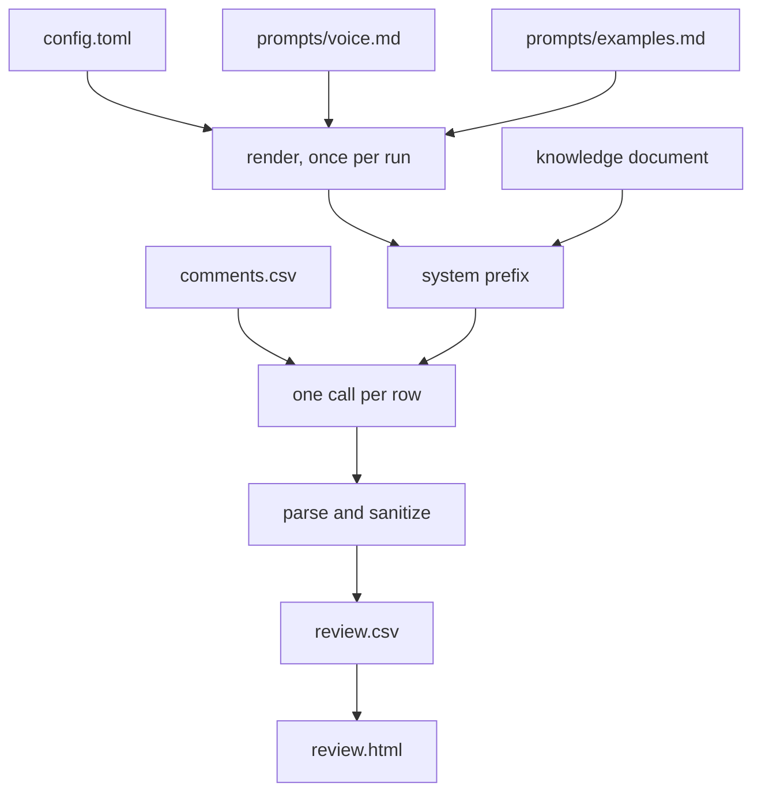

# Architecture

One model call per comment. No database, no queue, no background process, no
retrieval step. The one exception is an empty comment: it is decided locally, as
skip, with no call and no cost, because there is nothing in it to answer. Past
that exception, the design is one idea carried consistently, and this page is
that idea plus the point at which it stops being right.

## The shape of a run

Every request is the same large static prefix followed by one short user message
holding a single comment. The prefix is: your rendered voice rules, your rendered
worked examples, the engine-owned output contract, and then the entire knowledge
document wrapped in a tag.

## Why the prefix is assembled exactly once

The prefix is byte-identical across every call in a run, so the provider serves it
from its prompt cache after the first call and bills the cached rate for it. That
property is the whole economic argument for the design, and it is fragile in exactly
one way: **nothing that varies per row may enter the prefix.** A timestamp, a row
counter, a per-comment CTA choice, or a shuffled example order all cost the same
thing, which is every cache hit in the run.

So the system prefix is rendered once, before the loop starts, and the loop only
appends the row. If you are adding a feature and it wants to reach into the prefix,
that is the constraint you are trading against. Say so in the pull request.

Two honest notes about caching:

- The cache is not warm on every call, even mid-run. Providers expire prefixes on
  their own schedule and you will see cold calls in the middle of a run. Cost is
  computed per row from the token counts the API actually returned, never from an
  assumption, so the report stays true either way.
- Editing your config, your voice file, or your knowledge document changes the
  prefix, which makes the next call cold. That is normal and it is not a bug report.

Measured once, and only once. `docs/bakeoff.md` writes up a bake-off run on 2026-08-01
against the field guide example, in which a 4,162 token prefix was served from cache on
28 of 29 calls on the default route and on none at all on the two others. Per comment,
the default came out about 8 times under one of those routes and about 27 times under
the other, on published rates whose difference was much smaller than either figure. The
first note above is visible in the same table: one call in twenty-nine was cold. That
is this section measured rather than asserted, and it is one run on one example on one
day, so read the caveat that ships with it before carrying the numbers anywhere.

## Why there is no retrieval

Retrieval exists to fit a corpus that does not fit the window. It buys that at the
price of a new failure mode: the retriever misses the relevant passage, the model
answers anyway, and the answer is confident and wrong. In a pipeline whose entire
value proposition is that a draft may only state what the source document states,
that failure mode is the expensive one.

While the source fits the context window, the cached prefix is both cheaper than
retrieval and free of that failure mode, because there is nothing to miss. So there
is no vector store, no chunker, no embedding step, and no similarity threshold to
tune.

## Where that stops being true

This works because the knowledge base is **one document** that fits in the context
window. Both halves matter.

- If your source grows past the window, the design is simply wrong for you. That is
  the point at which retrieval becomes the right answer, and this project does not
  pretend otherwise. It is listed in `docs/limits.md` as a limit rather than hidden as
  a roadmap item.
- If your source is many documents, the `text` source concatenates a directory of them
  in sorted order with a heading per file, which is fine until the total crosses the
  window. It is the same limit wearing a different hat.

There is no partial answer here. The tool does not silently truncate your knowledge to
fit; a source larger than the window is your problem to solve before you run.

## Modules

| Module | Owns |
|---|---|
| `config.py` | loading and shape validation. Never validates truth. |
| `sources/` | knowledge intake registry: `text` by default, `pdf_vision` behind an extra |
| `prompt.py` | placeholder substitution, prefix assembly, `build_messages` |
| `engine.py` | the call, the retry policy, the per-row loop |
| `sanitize.py` | `sanitize_reply`, `find_repetition`, `is_plug` |
| `report.py` | `estimate_cost`, the run report |
| `bakeoff.py` | the model list for a multi-model run |
| `render/review_html.py` | the reviewer artefact, plain or blind, and the key that unmasks a blind page |
| `ui.py` | the local test page, with the full trace |
| `cli.py` | subcommands |

## Three failure classes, three behaviours

The retry policy is deliberately not uniform, because the three things that go wrong
want three different responses:

1. **A response that will not parse** gets exactly one retry with a nudge. Models
   sometimes wrap JSON in prose; asking again usually fixes it, and asking a third
   time usually does not.
2. **A rate limit or a 5xx** gets backed off and retried. The provider is telling you
   the call did not go through. Losing rows to a burst of 429s is the avoidable failure
   here.
3. **Anything else** fails immediately: a rejected key, a malformed request, an unknown
   model. It will fail identically forever, and retrying only delays the message you
   need to read.

Any row that ends in an error is written to the CSV with its error text, and the
process exits non-zero. A run that silently produced fewer rows than it read is the
outcome this is written to prevent.
